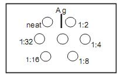
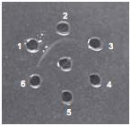

#### Materials Required
 
1. Antigen solution
2. Test antiserum
3. Assay Buffer
4. Agarose
5. Glass plate
6. Template
7. Micropipette and tip
8. Beaker
9. 1.5ml Vials and vial rack
10. Measuring cylinder
11. Petri plate
12. Gel punch with syringe
13. Conical flask
14. Distilled water
15. Wash bottle
16. Cotton

&nbsp;

### Procedure

1. Boil to dissolve 100 mg of agarose in 10 ml of 1X assay buffer. Cool to 55°C.
 

2. Pour 5 ml of the gel solution onto a clean glass plate placed on a horizontal surface. Allow the gel to set ; it takes approximately 20- 30    minutes.
 

3. Place the gel plate on the template provided. Punch wells in the gel with the help of a gel punch corresponding to the markings on the template. Use gentle suction to avoid forming rugged wells.
 

4. Take six vials and label as neat, 1:2, 1:4, 1:8, 1:16, 1:32.
 

5. Serially dilute the test antiserum up to 1:32 dilution as follows:
                      
• Take 20 µl of 1X assay buffer in each of the five vials (labeled from 1:2 through 1:32).
• Add 20 µl of test antiserum into the first vial and mix well. The dilution of antiserum in this vial is 1:2.
• Transfer 20 µl of 1:2 diluted antiserum from the first vial into the second vial. The dilution in this vial is 1:4
• Repeat the dilutions up to fifth vial.

 

6. Add 10 µl of the antigen to the centre well and 10 µl each of  neat (undiluted), 1:2, 1:4, 1:8, 1:16, 1:32 dilutions of antiserum into the surrounding wells.

&nbsp;

&nbsp;

7. Place the plate in a moist chamber and incubate at room temperature, overnight.
8. After incubation, observe for opaque precipitin line between the antigen and antisera wells.

 

### Observation and Results
 

The precipitin lines will be visible in 24-48 hours. You should be able to see opaque white arcs in each side of the plate where the antibody and antigen precipitated. Note down the highest dilution at which the precipitin line is formed. This is the titre value of the antiserum.

Note: If the precipitin line is not visible then wash the gel with 1X assay buffer for 30  minutes.

&nbsp;

&nbsp;

In this figure, the titre value of the antiserum is 1:2

 

#### Precautions

1.    If you are provided with 10X assay buffer, dilute the required amount of 10X assay buffer to 1X with distilled water.
2.    Reconstitute the antigen vial with 0.2 ml of 1X assay buffer if needed. Mix well, store at 4°C and use within 3 months.
3.    Reconstitute the antiserum vial with 0.5 ml of 1X assay buffer if needed. Mix well, store at 4°C and use within 3 months.
4.    Wipe the glass plates with cotton, make it grease free for even spreading of agarose.
5.    Cut the wells neatly without rugged margins. Ensure that the moist chamber has enough wet cotton to keep the atmosphere humid.
6.    Wear heat protective gloves when making the agarose solution.
