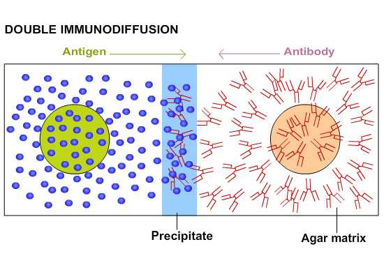

### Principle

The key reaction of immunology and immune defense is the interaction of antibodies and antigens.  This interaction  is responsible for the body’s defense against viral and bacterial infections and other toxins.  The body’s defense mechanism  recognizes foreign substances, or antigens, and raises specific antibodies against them.   
 
&nbsp;

The antibodies bind to the antigens and form large macromolecular complexes.  These complexes are formed due to the fact that each antibody can associate and bind with more than one antigen and each antigen can be bound by more than one antibody molecule. The noncovalent interactions that form the basis of antigen-antibody (Ag-Ab) binding include hydrogen bonds, ionic bonds, hydrophobic interactions, and Vander Waals interactions   The formation of the large macromolecules results in their precipitation and the resulting precipitate is cleared by the body by various mechanisms.  The interaction of antigen and antibody, resulting in precipitation, is also useful in research and diagnostics.

&nbsp;

The specificity of antigen-antibody interactions has led to the development of a variety of immunologic assays, which can be used to detect the presence of either antibody or antigen. Immunological assays play an important role in diagnosing diseases, monitoring the level of the humoral immune response, and identifying molecules of biological or medical interest. These assays differ in their speed and sensitivity; some are strictly qualitative, others are quantitative.

&nbsp;

Immune precipitates can form in an agar matrix. When antigen and antibody diffuse toward one another in agar, or when antibody is incorporated into the agar and antigen diffuses into the antibody containing matrix, a visible line of precipitation will form. As in a precipitation reaction in fluid, visible precipitation occurs in the region of equivalence, whereas no visible precipitate forms in regions of antibody or antigen excess. Two types of immunodiffusion reactions can be used to determine relative concentrations of antibodies or antigens, to compare antigens, or to determine the relative purity of an antigen preparation. They are radial immunodiffusion (the Mancini method) and double immunodiffusion (the Ouchterlony method); both are carried out in a semisolid medium such as agar.

&nbsp;

The Ouchterlony double diffusion (ODD) technique is one of the simplest techniques extensively used to check antisera for the presence of antibodies for a particular Ag and to determine its titre. This method has been widely used for detection and qualitative diagnostic procedures.  The method is called "double" referring to the fact that in this procedure, antigen and antibody are allowed to migrate towards each other in a gel and a line of precipitation is formed where the two reactants meet. This precipitation reaction is highly specific. The method is even today widespread and used by people working with diagnosis or protein detection or comparing antigens or antisera. The method is not very sensitive.

&nbsp;

The technique involves cutting wells into an Agarose solidified in a glass plate. The wells are filled with antibody or antigen and the plate is incubated. When homologous antigen and antibody diffuse toward each other from the individual wells, a precipitin line will form somewhere between the two wells. Precipitation occurs because the antigen is multivalent i.e,has several antigenic determinants per molecule to which antibodies can bind. Antibodies have at least two antigen binding sites, thus large aggregates or lattices of antigen and antibody are formed. Precipitation will not occur if excess antigen is present or if excess antibody is present. Cross-linking and lattice formation will only occur when antigen and antibody concentrations are optimal. An increasing amount of antigen is added to a constant amount of antibody in solution. This is called the antibody-excess zone (Prozone phenomenon). The Ag and Ab concentrations are relatively higher near their respective wells. As they diffuse farther from the wells, their concentration decreases. An antigen will react with its specific antibody to form an Ag-Ab complex.  As more antigens are added, the amount of protein precipitated increases until the antigen/antibody molecules are at an optimal ratio. This is known as the equivalence zone or equivalence point. When the amount of antigen in solution exceeds the amount of antibody, the amount of precipitation will decrease. This is known as the antigen excess zone.

&nbsp;

